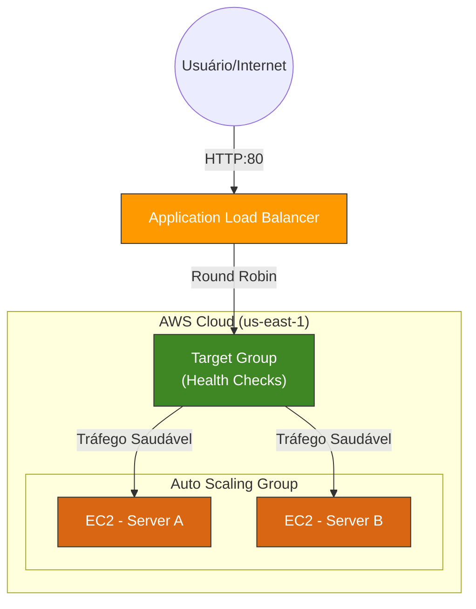

# AWS Elastic Bot 🤖

Ferramenta de Automação de Infraestrutura (IaC) desenvolvida em Python com Boto3.
Este projeto provisiona um cluster web de Alta Disponibilidade (HA) na AWS, utilizando Auto Scaling, Load Balancer e Security Groups.

## 🏗️ Arquitetura do Projeto

O sistema constrói automaticamente a seguinte topologia na região `us-east-1`:




## 📂 Estrutura de Arquivos
A organização do projeto segue o padrão de separação entre código de infraestrutura e documentação:

```plaintext
aws-elastic-bot/
│
├── infra/
│   └── setup_infrastructure.py   # Script principal de provisionamento (Boto3)
│
├── assets/                       # Evidências (Prints e Diagramas)
├── .gitignore                    # Arquivos ignorados (venv, .aws)
├── requirements.txt              # Dependências (boto3)
└── README.md                     # Documentação do projeto
```

## 🚀 Como Executar

1. Instale as dependências:
```bash
pip install -r requirements.txt
```

2.Execute o provisionamento:
```bash
python infra/setup_infrastructure.py
```